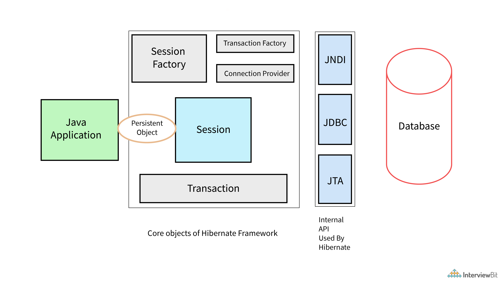
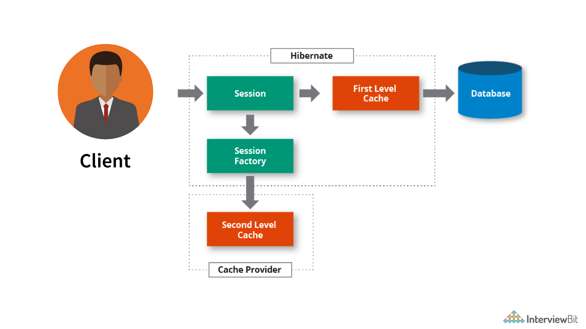
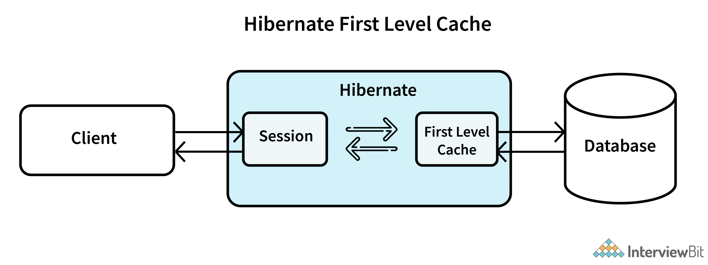
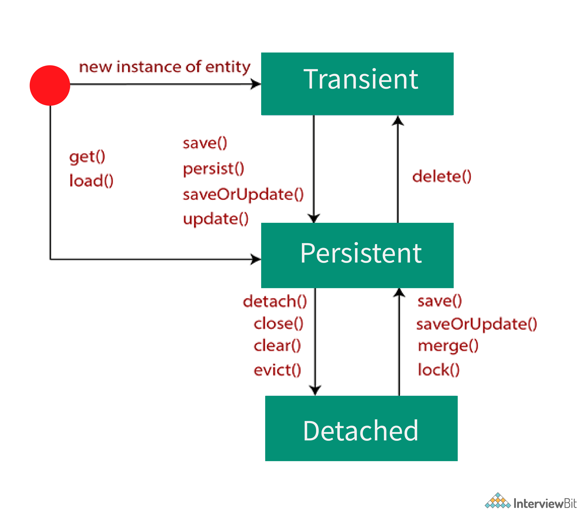

- **ORM -** Object Relation Mapping
- **HQL -** Hibernate Query Language

### Hibernate architecture

Criteria API in Hibernate helps developers to build dynamic criteria queries on the persistence database. Criteria API is a more powerful and flexible alternative to HQL (Hibernate Query Language) queries for creating dynamic queries.

