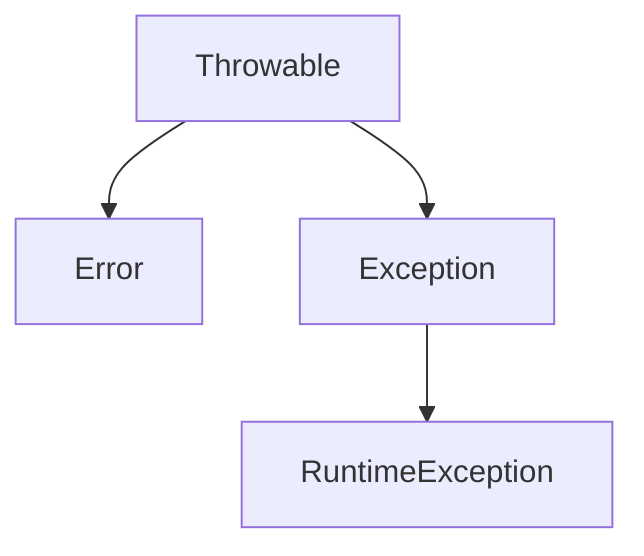

## `S`oftware `D`evelopment `L`ife`c`ycle

### 1. Requirement Analysis phase

- Software Requirement Specification (SRS) Document
- Usecase diagram
- feasibility study.

### 2. Designg phase

- modeling
- class diagram
- sequence diagram
- Activity diagram
- Flow chart

### 3. Development phase

- Source code & logic

### 4. Testing phase

- Unit testing (junit)
- Integration testing
- User acceptance testing

### 5. Deployment phase

- Adding project in production environment

### 6. Maintanace phase

- post implementation
- services

## Waterfall model

## Prototye model

## Incremental model

## V - Model

## Agile process

Kanban and Scrum are the two most commonly referred to Agile methodologies. Both Kanban and Scrum encourage teams to embrace continuous improvement.

One of the core tenets of Agile methodology is flexibility and continuous improvement—in fact, it’s one of the reasons product, engineering, and software development teams are so drawn to Agile philosophies. Continuous improvement is a big part of both Kanban and Scrum.

- Scrum is more defined than Kanban
- Scrum is time-bound, Kanban is flexible.
- Kanban board columns can be organized in different ways

[1][https://asana.com/resources/agile-methodology]

- Catelog
- Story
- Story point
- Sprint
- Backlog
- retrospect
- review
- signoff
- burndown chart

## Reflection API

Reflection API is the answer for the **why the main method is must be `public static` even the class is not public.**

System wiil load the class into memory using `Class.forName(...)` without creating object.

## Exception

Execption is an _Abnormal_ condition of program at runtime. `Error` is unsolvable by the program. `RuntimeException` is parent class for all **un checked exceptions**.

- checked execptions raise at compile time
- un checked execptions are raise at runtime.

If you are going to use any **resource** in your programm you need to handle **checked exceptions**. use `throws` to transfer the exception to caller without handling the execption. 

### User defined exceptions

- do i need to override the `toString()` in user defined execeptions?.
- use `throw` to raise an exception.

## JDBC

1. load the driver `Class.forName(driverName)`
2. getting the connection `DriverManager.getConnection(dbName, username, password)`
`jdbc:<subprotocol>://<host>:<port>/<database>`
3. create the dynamic query `Statement` & `PreparedStatement`.
4. execute query
5. close the connection.

