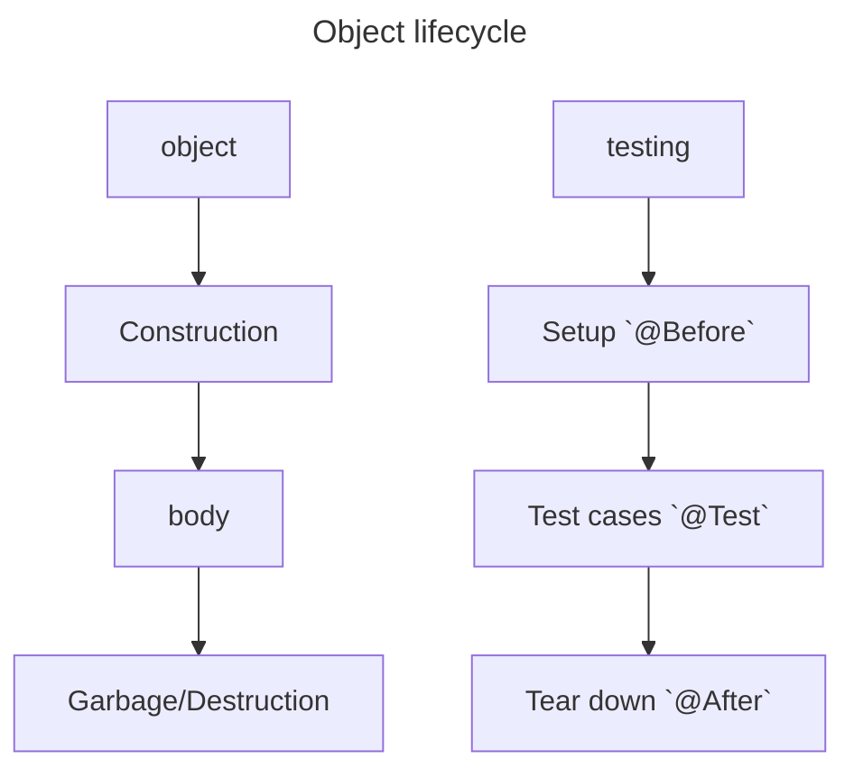

## Logging

1. add dependency to `pom.xml`

```java
import org.apache.log4j.FileAppender;
import org.apache.log4j.Logger;
import org.apache.log4j.TTCCLayout;

// initiate logger with name
Logger log = Logger.getLogger("name");
FileAppender file = new FileAppender(new SimpleLayout(), filename);

log.addAppender(file);

// call log methods
log.info("information");
log.debug("Debug information");
log.error("error message", exception);
```

## Testing

### User Accepetance Testing
### Integration Testing

### Unit Testing


object lives between new (construction) and garbage (destruction) phases.

`@BeforeClass`: it’s preferable to execute it only once before running all tests

`@AfterClass`: 
`@Before`
`@After`
`@Test`

## SQL transactions

**A**utomic, **C**Onsistancy, **I**solation, **D**urability principles.

it will work on centralized databaases not in distributed databases.
