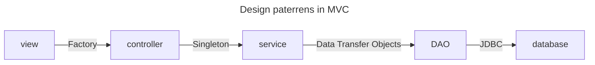
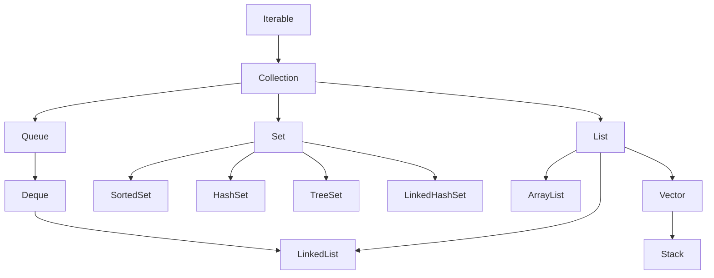

## SQL functions

User defined functions
- scalar functions
- 

Pre defind functions
- aggregate functions
    - avg
    - sum
    - min
    - max
    - count
- character functions
- date functions

## Triggers

## Stored procesdures
A stored procedure is a prepared SQL code that you can save, so the code can be reused over and over again.

So if you have an SQL query that you write over and over again, save it as a stored procedure, and then just call it to execute it.

You can also pass parameters to a stored procedure, so that the stored procedure can act based on the parameter value(s) that is passed.

## JDBC Statement

- `Statement`: for static query
- `PreparedStament`: to create dynamic query
- `CallebleStatement`: stored procedures.

in the case of Statement Query compilation & Query execution happens every time.

for DML `executeUpdate(): Integer`

for DQL `executeQuery(): ResultSet`

for DCL, TCL `execute(): Boolean`

## Collection framework

`Iterator`

**Set** does not allow duplicate values, whereas **List** allow duplicate values.

## Sorting

`source.compareTo(other)` comparing the other object with the source object with implemented `Comperable` interface.

`comparator.compare(one, two)` comparing the two objects with comparator object.

both return
- -1 smaller
- 0 equal
- 1 greater than other

`Collections.sort(collection, comparator)`

