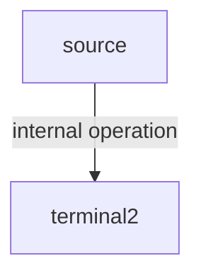

## ER diagram

## Views

## Normalization

## FUnctional programming

| interface            | parameters | return  | method name |
| -------------------- | ---------- | ------- | ----------: |
| `java.util.function` |
| Consumer             | T          | -       |      accept |
| BiConsumer           | T, U       | -       |      accept |
| Supplier             | -          | T       |         get |
| Predicate            | T          | boolean |        test |
| BiPredicate          | T, U       | boolean |        test |
| Function             | T          | R       |       apply |
| UnaryOperator        | T          | T       |       apply |
| BiFunction           | T, U       | R       |       apply |
| BinaryOperator       | T, T       | T       |       apply |

## Streams
a sequence of elements from a source that supports aggregate operations.

- Sequential streams
- Parallel streams

