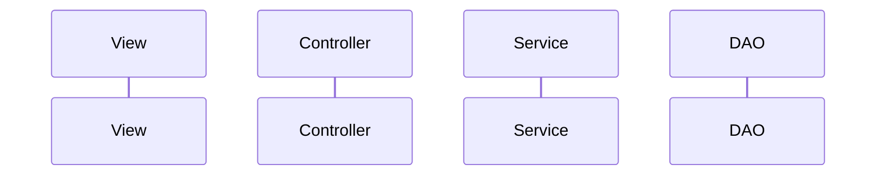

## Why object

There are 5 memory areas:

- Heap: Global variables
- Stack: Local variables
- Method area
- Program counter
- Native: Native code

Procedural language follows the single stack for the execution of functions in the heap memory, it is impact the performance of an application that's why to reduce the oveload there is `malloc` to create the dynamic memory at the runtime. in Java `new` keyword is an internally uses the malloc.

```java
class B { // class
    B() {
        // default constructor
    }
}

B b = new B()
// from left b is an instance of B.
// from right side b is reference to B.
```

## Compilation

1. C, C++ languages are platform dependent becuase of it's compilation procedure **.obj file**.
2. _Java is dynamic_ language since, it generate machine code at the runtime.

## Layered architeture

No one start from the scratch, they create solutions for the problems like _micro services, security, performance improvement_ but they don't replace or remove this structure.



## Project creation using eclipse & maven

**Project lifecycle:** Compiling, building, packaging and testing

- 1 register = 8 bits
- 1 filp-flop = 1 bit
- 1 byte = 8 bits
- There are two types of typecastings implicit (👇), explicit typecasting (👆).
- High cohension and loose coupling
- class can have public, private, protected and default properties.
- class is a firiend or child to other ones.
