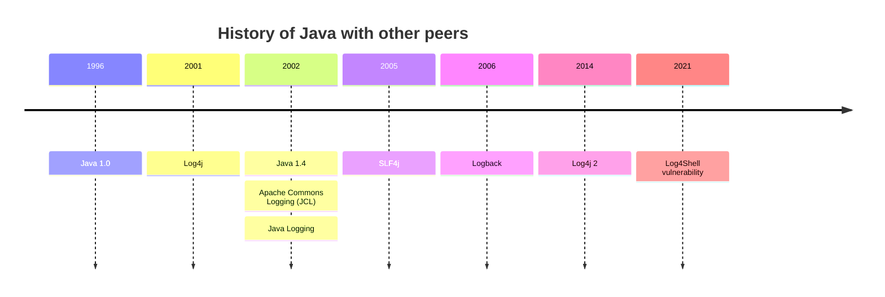

## Logging

logging is the act of keeping a log of events that occur in a computer system, such as problems, errors or just information on current operations. These events may occur in the operating system or in other software. A message or log entry is recorded for each such event.

- Event logs (System/ Application)
- Server logs (web server)
- Transaction logs (database transactions)

## Components

Following are the most common components used in the logging frameworks.

### Logger

A Logger is an object that allows the application to log without regard to where the output is sent/stored.

### Name

A logger has a name. The name is usually structured hierarchically, with periods (.) separating the levels. A common scheme is to use the name of the class or package that is doing the logging.

### Severity level

The message is logged at a certain level.

| Level   | description                  | log only |
| ------- | ---------------------------- | -------: |
| FATAL   | Severe errors                |       NO |
| ERROR   | Runtime errors               |       NO |
| WARNING | almost errors                |       NO |
| INFO    | Interesting runtime events   |       NO |
| DEBUG   | detailed flow through system |      YES |
| TRACE   | more detailed information    |      YES |

### Filter

Filters cause a log event to be ignored or logged

### Formatters

A Formatter is an object that formats a given object. Mostly this consists of taking the binary object and converting it to a string representation

### Appenders

The Appender takes the message it is passed and posts it appropriately. Message dispositions include:

- display on the console
- write to a file or syslog
- append to a database table

https://www.ralphgoers.com/post/why-was-log4j-2-created